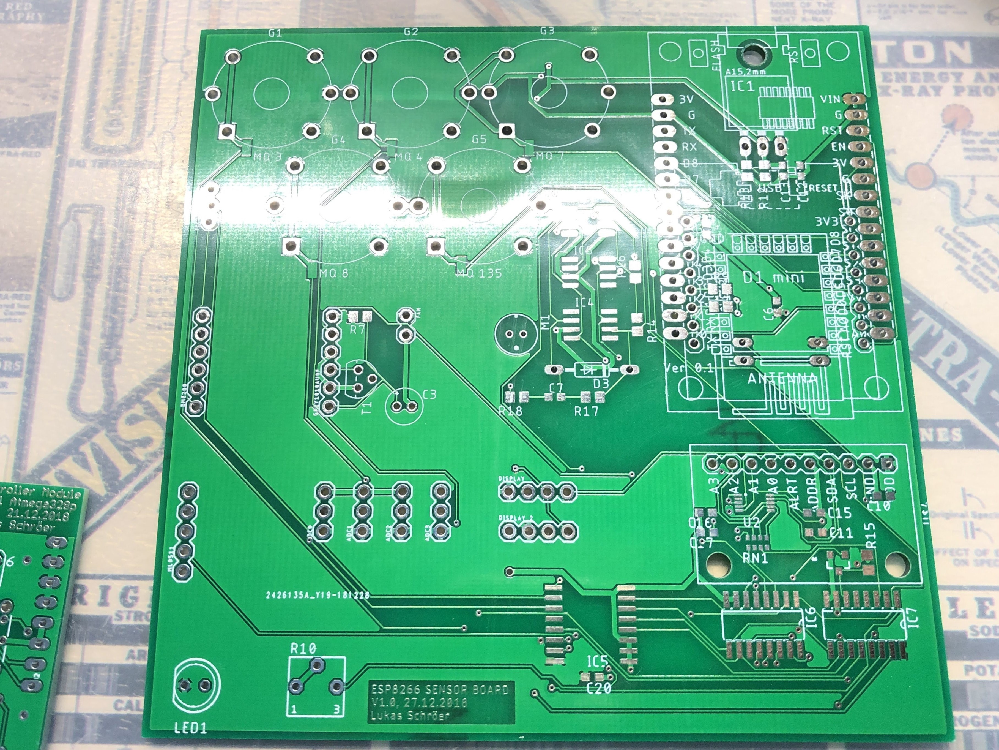
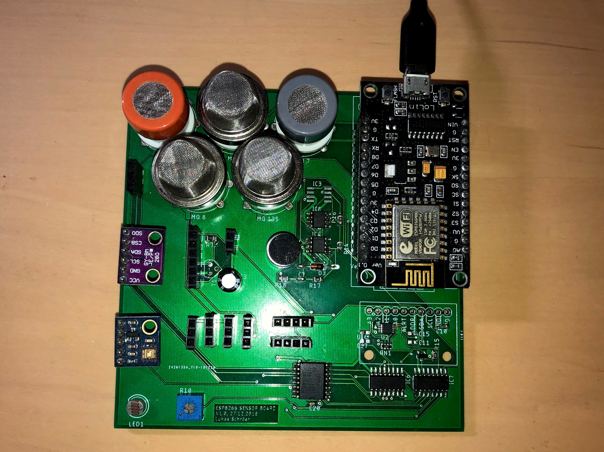
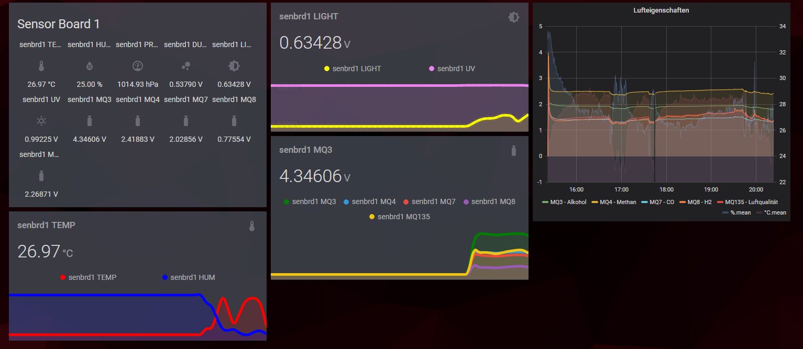

# Esp8266 IOT Sensorboard
A IOT Device with lots of sensors publishing acquired data via MQTT with automatic Home Assistant integration.
The board is equipped with following key components: 

* MQ Gas Sensors
    * MQ-3 Alcohol
    * MQ-4 CH4, LPG
    * MQ-7 CO
    * MQ-8 H2
    * MQ-135 Air-Quality
* BME280 Barometric Pressure, Temperature & Humidity
* GMYL8511 UV sensor
* GP2Y1010AU0F Sharp Dust Sensor
* Generic PIR Sensor
* Generic Microphone
* 5528 LDR
* PCF8574 I2C Port Expander
* ADS1115 16 bit ADC
* 74HC4051 8 channel Multiplexer

can be expanded with any other analog or i2c sensors.

Supports ESP8266 Boards NodeMCU & WeMos D1 mini

# Installation # 

just run the Platformio build task.